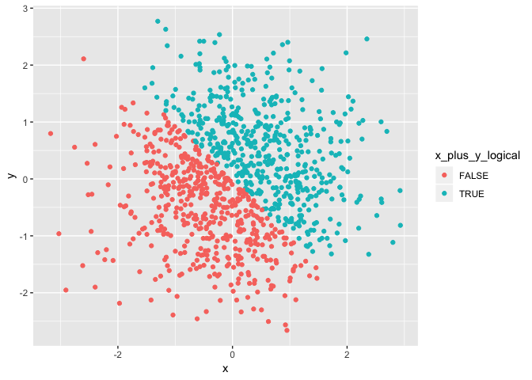
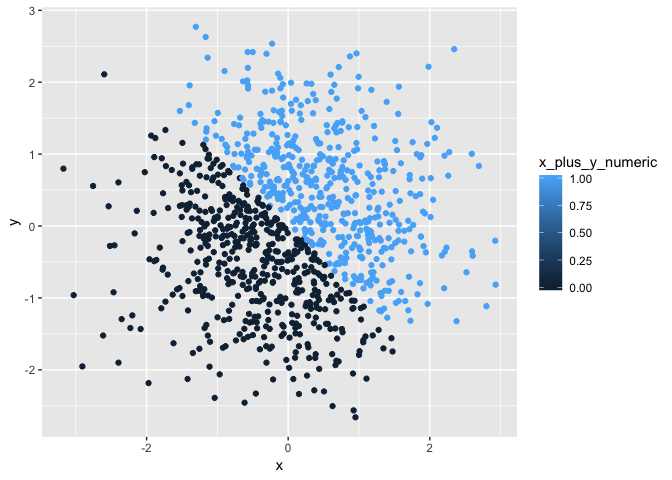
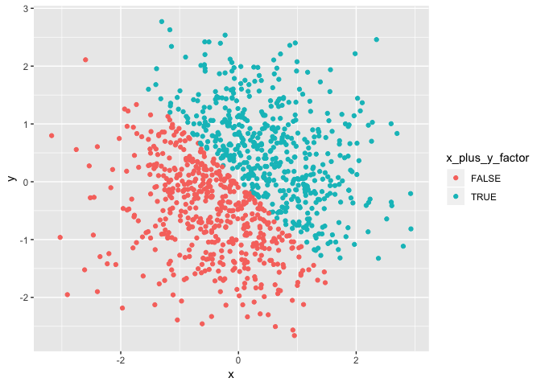

p8105\_hw1\_mm4963
================
Melanie Mayer
9/18/2018

### Question 1

Below is the code to create the data frame for Question 1.

``` r
q1_df = tibble(
  vec_numeric = runif(10, 0, 5),
  vec_logical = vec_numeric > 2,
  vec_char = c("hello", "i", "do", "not", "know", "what", "to", "write", "here", "soooo"),
  vec_factor = factor(c("level1", "level1", "level1", "level1", "level1", "level2", "level2",
                        "level2", "level2", "level2"))
)
```

Now I will try to get the mean for each vector in the data frame created.

``` r
mean(q1_df$vec_numeric)
```

    ## [1] 3.03618

``` r
mean(q1_df$vec_logical)
```

    ## [1] 0.7

``` r
mean(q1_df$vec_char)
```

    ## [1] NA

``` r
mean(q1_df$vec_factor)
```

    ## [1] NA

The numeric vector allows you to take the mean because it holds numeric values. The logical vector also allows you to take the mean because TRUE holds an underlying 1 value and FALSE holds an underlying 0 value and therefore the mean of the vector relies on these values. The character vector and the factor vector do not hold any numerical values and are therefore unable to produce a mean, resulting in a NA value.

Below I will try coerce non-numerical variables from the data frame into numerical values.

``` r
as.numeric(q1_df$vec_logical)
as.numeric(q1_df$vec_char)
as.numeric(q1_df$vec_factor)
```

When I do this, the logical vector turns into 1s and 0s (respectably for TRUE and FALSE) due to the underlying values of the TRUE and FALSE logical values. The character vector does not hold any underlying numerical value and therefore cannot be coerced into a numerical vector. NAs are produced. The factor vector, however, is able to be coerced into a numerical vector. R has levels for each factor, and the number related to each level is given to each value when coerced into a numeric vector.

Now I try to convert the character vector to a factor and then to a numeric as well as the factor vector to character and then to numeric.

``` r
as.numeric(factor(q1_df$vec_char))
```

    ##  [1]  2  4  1  6  5  9  8 10  3  7

``` r
as.numeric(as.character(q1_df$vec_factor))
```

    ##  [1] NA NA NA NA NA NA NA NA NA NA

The first coercion is able to accomplish the task. R factors the character values by giving each distinct character term a level, making each a factor. Once the newly factored character vector gets coerced into a numerical vector the same thing as above occurs, each level receives a numerical value to go with their level. It appears the numerical values are based on alphabetical order, going from one to ten.

The second coercion, however, is not able to be done and produces NAs. This is because a character vector will not hold underlying numerical values. Once the factor vector was coerced into a character vector the underlying numerical values that stood with each factor were removed and R is unable to give the newly created character values any numerical value.

### Question 2

Below is the code to create the data frame for Question 2.

``` r
q2_df = tibble(
  x = rnorm(1000),
  y = rnorm(1000),
  x_plus_y_logical = (x + y) > 0,
  x_plus_y_numeric = as.numeric(x_plus_y_logical),
  x_plus_y_factor = factor(x_plus_y_logical)
)
```

The size of the data set is 1000 rows and 5 columns. The mean of x is 0.0372122 and the median of x is 0.0251176. The mean of y is -0.0062695 and the median of y is 0.001484. The proportion of cases for which the logical vector is TRUE is 0.498.

Now I will plot x vs y

``` r
ggplot(q2_df, aes(x = x, y = y, color = x_plus_y_logical)) + geom_point() 
```



``` r
ggsave("scatter_plot_1.pdf")
ggplot(q2_df, aes(x = x, y = y, color = x_plus_y_numeric)) + geom_point()
```



``` r
ggplot(q2_df, aes(x = x, y = y, color = x_plus_y_factor)) + geom_point()
```



When coloring the points based on a logical or factor vector only two colors are chosen and used to color the points. This is because a logical vector can only hold two values, TRUE or FALSE, therefore only two colors are necessary. A factor vector can only have the amount of values as it does the number of factors. In this case there are only two factors since it was derived from a numerical vector originally derived from a logical vector. They are both discrete values. This is why the color scale for these two plots are the same and rigidly based on two colors.

When the numeric vector is used to color the scatter plot a range of blues is used to color the points. Even though only two number are actually seen in the data set, since it is a numerical vector it could technically hold any numerical value, it is continuous instead of discrete like logical and factor. The range allows anything from the smallest number seen (0) to the largest (1) to color the points.
